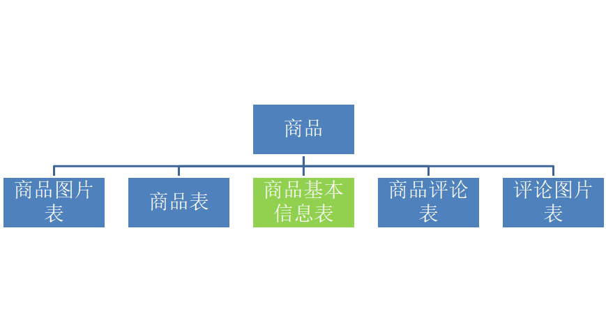

# 方兴商城

**电商网站**

**一、业务类型**

- O2O（Online To Offline)）          	线上转线下     	例如：百度外卖、糯米
- B2B（Business To Business）    	企业对企业     	例如：阿里巴巴
- C2C（Consumer To Consumer）	个人对个人    	例如：淘宝网、拍怕
- P2P（Peer To Peer）			小额借贷		例如：人人贷
- P2C（Production To Consumer）	生活服务平台	例如：餐饮、医疗、家政
- B2C（Business To Consumer）	商家对消费者	例如：天猫、京东

**二、功能设计**

**（一）用户前台角度**

- 首页加载
- 商品查询
- 注册登录
- 个人中心
- 购物车
- 订单
- 支付
- 物流
- 评价
- ......

**（二）商家后台角度**

- 商品发布更新
- 商品分类维护
- 商品明细
- 用户订单管理
- 用户物流更新
- 用户支付确认
- 促销、秒杀商品
- 销售报表统计
- ......

**三、开发计划**

1. 发布系统

   spu（商品信息聚合的最小单位，是一组可复用标准化信息的集合）

   属性

   sku（库存进出计量的单位， 可以是以件、盒、托盘等为单位）

2. 交易

    注册和登录

    检索

    购物车

3. 认证

   登录

   地址

4. 订单与支付

   订单

   支付

5. 安全与事务

   安全

   事务

**四、表结构设计**

**五、涉及技术点**

